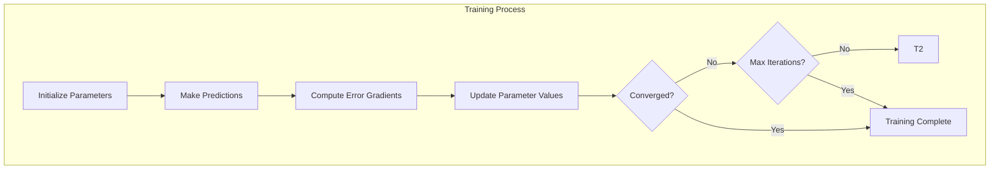

# Gradient Descent Process Flow

## Process Description

1. **Training Loop**
   - Makes predictions using current parameters: y = Mx + B
   - Calculates prediction errors:
     * Error = Expected - Predicted
     * Weight Error = Input * Error
     * Bias Error = Error
   - Computes error gradients:
     * Weight Gradient = Average of weight errors
     * Bias Gradient = Average of bias errors
   - Updates parameters:
     * M = M - (learning_rate * weight_gradient)
     * B = B - (learning_rate * bias_gradient)
   - Checks convergence:
     * |Weight Gradient| < threshold AND |Bias Gradient| < threshold
   - Continues until converged or max iterations (1,000,000) reached

1. **Error Metrics**
   - Mean Squared Error (MSE) calculation:
     * Square each prediction error
     * Calculate average of squared errors
   - Used for both training and test evaluation

1. **Model Persistence & Usage**
   - Saves trained model parameters to JSON if training converged
   - Interactive prediction loop:
     * Takes numeric input x
     * Calculates y = Mx + B
     * Displays result
